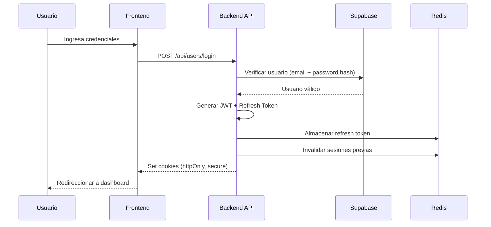
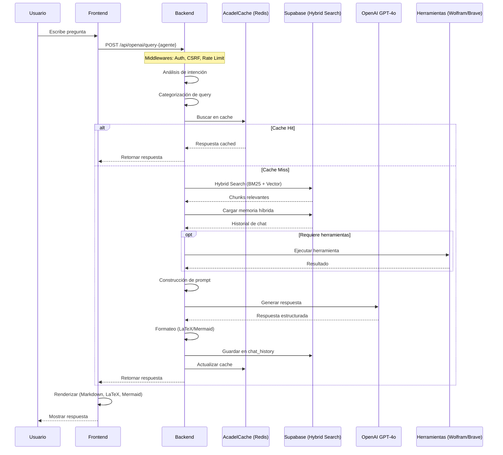
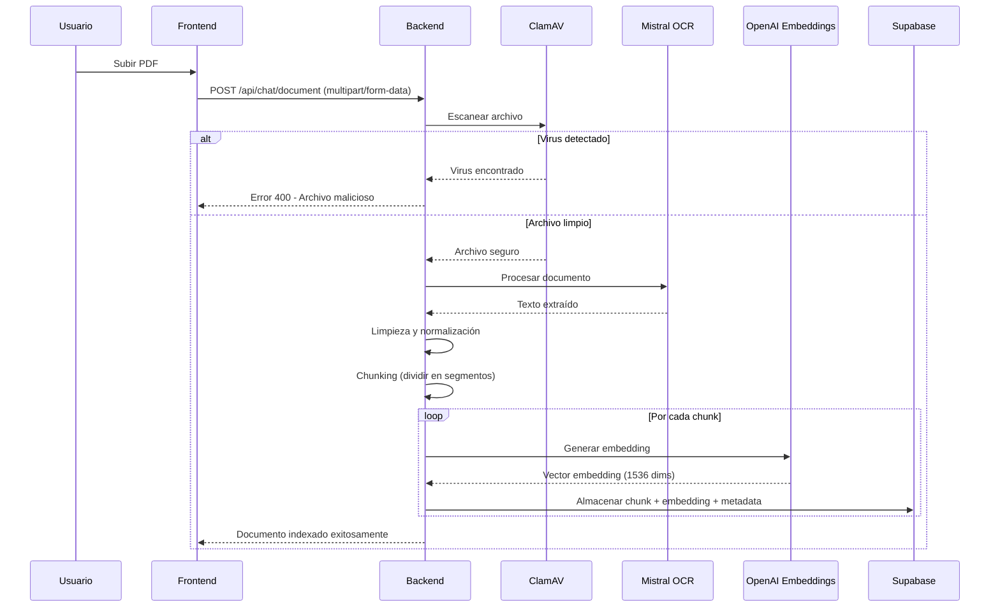
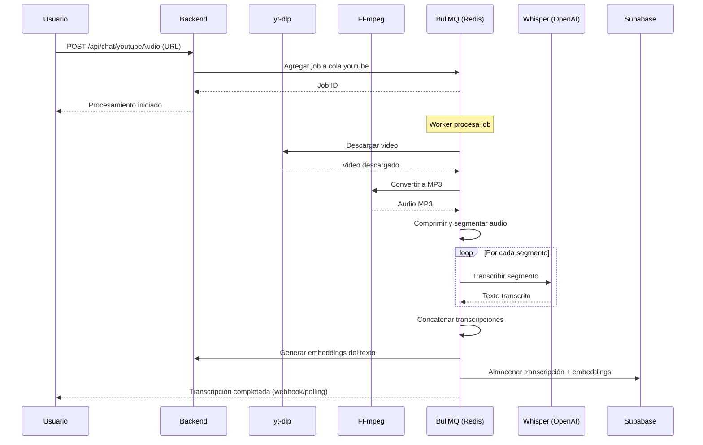
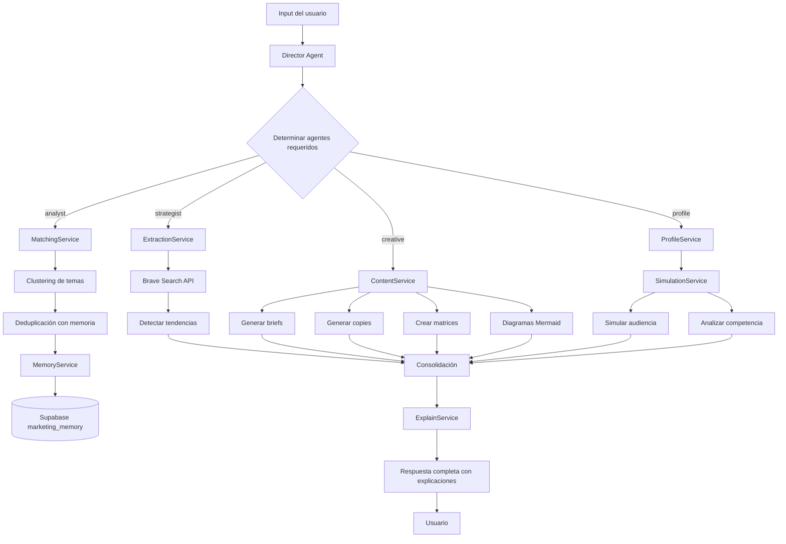

# Arquitectura de Acadelia

## Tabla de Contenidos

1. [Visión General](#visión-general)
2. [Arquitectura de Capas](#arquitectura-de-capas)
3. [Flujo de Datos](#flujo-de-datos)
4. [Componentes Principales](#componentes-principales)
5. [Patrones de Diseño](#patrones-de-diseño)
6. [Decisiones de Arquitectura](#decisiones-de-arquitectura)

---

## Visión General

Acadelia es una plataforma SaaS educativa que utiliza una arquitectura de **tres capas** (presentación, aplicación, datos) con un enfoque de **microservicios ligeros** y **servicios especializados** por dominio académico.

### Principios Arquitectónicos

1. **Separación de responsabilidades**: Frontend, backend y datos están claramente separados
2. **Especialización por dominio**: 40+ agentes especializados, cada uno con su propia base de conocimiento
3. **RAG distribuido**: Sistema de embeddings distribuido en múltiples tablas por materia
4. **Stateless backend**: El estado se maneja en Redis y Supabase, permitiendo escalado horizontal
5. **Seguridad por capas**: Múltiples niveles de protección (CSRF, JWT, rate limiting, antivirus)
6. **Cache inteligente**: Reducción de costos y latencia mediante cache semántico

---

## Arquitectura de Capas

### Capa 1: Presentación (Frontend)

**Tecnología**: HTML5 + CSS3 + JavaScript Vanilla + Nginx

**Responsabilidades**:

-   Renderizado de interfaz de usuario
-   Gestión de estado local (sesión, chat actual)
-   Comunicación con API backend vía fetch
-   Renderizado de LaTeX (MathLive) y Mermaid
-   Validación de inputs del lado del cliente

**Estructura de Módulos**:

```
frontend/
├── public/
│   ├── css/
│   │   ├── chats/         # Estilos modulares por tipo de chat
│   │   │   ├── base/      # Reset, variables, fuentes
│   │   │   ├── layout/    # Estructura de página
│   │   │   ├── components/# Componentes reutilizables
│   │   │   └── utils/     # Utilidades y helpers
│   │   └── chiguiremarketing/  # Panel admin marketing
│   └── scripts/
│       ├── chats/
│       │   ├── matematico/     # Lógica chat matemático
│       │   ├── teorico/        # Lógica chat teórico
│       │   └── herramientas/   # PDF, Agente, etc.
│       └── shared/             # Código compartido
└── views/
    ├── auth/              # Login, registro
    ├── dashboard/         # Dashboard principal
    ├── content/           # Chats por materia
    └── admin/             # Paneles administrativos
```

**Decisiones Clave**:

-   **Sin framework JS**: Para reducir bundle size y tener control total
-   **CSS modular**: Arquitectura basada en componentes, escalable
-   **Nginx como reverse proxy**: Maneja static files y proxy a backend

---

### Capa 2: Aplicación (Backend)

**Tecnología**: Node.js 22 + Express.js + LangChain

**Responsabilidades**:

-   Procesamiento de requests HTTP
-   Autenticación y autorización (JWT)
-   Orquestación de agentes IA
-   Sistema RAG (embeddings + hybrid search)
-   Procesamiento de archivos (PDF, audio, video, imágenes)
-   Integración con servicios externos (OpenAI, Mistral, WolframAlpha, etc.)
-   Manejo de colas (BullMQ)
-   Logging y monitoreo

**Arquitectura de Backend**:

```
backend/
├── server.js              # Punto de entrada, configuración Express
├── controllers/           # Controladores por agente/dominio
│   ├── ingenieria/
│   │   ├── algebraController.js
│   │   ├── calculoController.js
│   │   └── ...
│   ├── medicina/
│   │   ├── patologiaController.js
│   │   ├── semiologiaController.js
│   │   └── ...
│   ├── economia/
│   │   ├── microeconomiaController.js
│   │   └── ...
│   ├── psicologia/
│   │   ├── dsm5Controller.js
│   │   └── ...
│   └── herramientas/
│       ├── pdfController.js
│       └── agenteController.js
├── services/              # Lógica de negocio
│   ├── chat/
│   │   ├── chatServices.js           # Orquestador central
│   │   ├── {materia}Service.js       # 40+ servicios especializados
│   │   ├── ragService.js             # Sistema RAG compartido
│   │   └── memoryService.js          # Gestión de memoria híbrida
│   ├── marketing/
│   │   ├── directorAgent.js          # Agente director
│   │   ├── extractionService.js      # Extracción de insights
│   │   ├── matchingService.js        # Clustering y deduplicación
│   │   ├── memoryService.js          # Memoria del agente marketing
│   │   ├── contentService.js         # Generación de contenido
│   │   ├── simulationService.js      # Simulación de audiencia
│   │   └── explainService.js         # Explicaciones de decisiones
│   ├── transcription/
│   │   ├── whisperService.js         # Transcripción de audio
│   │   └── youtubeService.js         # Descarga y conversión
│   ├── ocr/
│   │   ├── mistralOCRService.js      # OCR con Mistral
│   │   └── pdfProcessingService.js   # Procesamiento de PDFs
│   └── payments/
│       ├── paddleService.js          # Integración Paddle
│       └── ualaService.js            # Integración Ualá Bis
├── middlewares/           # Middlewares de Express
│   ├── authMiddleware.js             # JWT authentication
│   ├── csrfMiddleware.js             # CSRF protection
│   ├── rateLimitMiddleware.js        # Rate limiting
│   ├── accessControlMiddleware.js    # Control de acceso a AVAs
│   ├── securityMiddleware.js         # Validaciones de seguridad
│   └── errorMiddleware.js            # Manejo de errores
├── jobs/                  # Jobs de BullMQ
│   ├── openaiQueue.js                # Cola de requests a OpenAI
│   ├── pdfQueue.js                   # Procesamiento de PDFs
│   ├── audioQueue.js                 # Transcripción de audio
│   └── youtubeQueue.js               # Descarga de YouTube
├── lib/                   # Clientes de servicios externos
│   ├── openai.js                     # Cliente OpenAI
│   ├── mistral.js                    # Cliente Mistral
│   ├── supabase.js                   # Cliente Supabase
│   ├── redis.js                      # Cliente Redis
│   └── ...
└── utils/                 # Utilidades
    ├── chat/
    │   ├── AcadelCache.js            # Sistema de cache inteligente
    │   ├── contextCleaner.js         # Limpieza de contexto
    │   └── intentDetector.js         # Detección de intención
    ├── file/
    │   ├── fileCleanupService.js     # Limpieza de archivos
    │   └── imageStorageService.js    # Almacenamiento de imágenes
    └── security/
        ├── csrfUtils.js              # Utilidades CSRF
        └── securityLogger.js         # Logger de seguridad
```

**Flujo de Request típico**:

```
1. Request HTTP → Nginx → Express
2. Middlewares de seguridad (CSRF, rate limit, auth)
3. Router → Controller específico
4. Controller → Service (lógica de negocio)
5. Service → Integraciones externas (OpenAI, Supabase, etc.)
6. Response procesada → Cliente
```

---

### Capa 3: Datos

**Tecnología**: Supabase (PostgreSQL 14+ con pgvector) + Redis 7

#### Supabase (Base de Datos Principal)

**Responsabilidades**:

-   Almacenamiento de datos relacionales
-   Vector database para RAG (embeddings)
-   File storage (PDFs, imágenes, audio)
-   Authentication (opcional, no usado actualmente)

**Esquema de Tablas**:

**1. Sistema de Usuario**:

```sql
users                           -- Información de usuarios
cookie_consent                  -- Consentimientos de cookies
account_deletion_requests       -- Solicitudes de eliminación
deleted_accounts                -- Cuentas eliminadas (histórico)
deletion_log                    -- Log de eliminaciones
activity_log                    -- Log de actividad de usuarios
```

**2. Sistema de Chat**:

```sql
chat                            -- Chats creados por usuarios
chat_history                    -- Historial de mensajes
ava                             -- Agentes virtuales (40+)
herramienta                     -- Herramientas (PDF, Agente)
carrera                         -- Carreras académicas
```

**3. Sistema de Embeddings (RAG)**:

```sql
-- Ingeniería (11 tablas)
emb_algebra
emb_calculo
emb_fisica
emb_quimica
emb_estadistica
emb_electricidad_electronica
emb_matematicas_avanzadas
emb_computacion_sistemas
emb_redes_seguridad
emb_resistencia_materiales

-- Medicina (10 tablas)
emb_patologia
emb_semiologia
emb_ciencias_basicas
emb_ciencias_aplicadas
emb_medicina_interna
emb_cirugia_urgencias
emb_especialidades_medicas_1
emb_especialidades_medicas_2
emb_epidemiologia
emb_matematica_medica

-- Economía (10 tablas)
emb_microeconomia
emb_macroeconomia
emb_econometria
emb_economia_internacional
emb_economia_laboral
emb_finanzas
emb_sector_publico
emb_historia_economica
emb_desarrollo_economico
emb_calculo_economico

-- Psicología (10 tablas)
emb_dsm5
emb_psicoanalisis
emb_neuropsicologia
emb_psicologia_evolutiva
emb_psicologia_general
emb_psicologia_social
emb_psicopatologia
emb_psicodiagnostico
emb_psicoestadistica
emb_epistemologia

-- Total: 40+ tablas de embeddings
```

**Estructura típica de tabla de embeddings**:

```sql
CREATE TABLE emb_algebra (
  id UUID PRIMARY KEY,
  content TEXT,                    -- Contenido textual
  embedding VECTOR(1536),          -- Embedding OpenAI
  metadata JSONB,                  -- Metadata adicional
  created_at TIMESTAMP,
  updated_at TIMESTAMP
);

-- Índice para búsqueda vectorial
CREATE INDEX ON emb_algebra USING ivfflat (embedding vector_cosine_ops);
```

**4. Sistema de Marketing**:

```sql
marketing_trends                -- Tendencias detectadas (con embeddings)
marketing_profiles              -- Perfiles de audiencia
marketing_content               -- Contenido generado
marketing_memory                -- Memoria del agente marketing
```

**5. Sistema de Pagos**:

```sql
egresos                         -- Gastos registrados
categorias_egresos              -- Categorías de gastos
analisis_impuestos              -- Análisis de impuestos
```

**6. Configuración**:

```sql
config                          -- Configuración global
```

#### Redis (Cache y Colas)

**Responsabilidades**:

-   Cache de sesiones (JWT tokens)
-   Rate limiting distribuido
-   Colas de procesamiento (BullMQ)
-   Locks distribuidos
-   Cache de resultados de chat (AcadelCache)

**Namespaces en Redis**:

```
acadelia:sessions:{userId}           -- Sesiones de usuario
acadelia:ratelimit:{identifier}      -- Rate limiting
acadelia:cache:{cacheKey}            -- Cache de respuestas
bull:{queueName}:*                   -- Colas de BullMQ
```

**Colas BullMQ**:

```javascript
-throttle -
    openai - // Throttling de requests a OpenAI
    throttle -
    pdf - // Procesamiento de PDFs
    throttle -
    audio - // Transcripción de audio
    throttle -
    youtube; // Descarga de YouTube
```

---

## Flujo de Datos

### 1. Flujo de Autenticación



### 2. Flujo de Chat con RAG



### 3. Flujo de Procesamiento de PDF



### 4. Flujo de YouTube → Transcripción



### 5. Flujo del Agente de Marketing



---

## Componentes Principales

### 1. Sistema RAG (Retrieval-Augmented Generation)

**Ubicación**: `backend/services/chat/`

**Componentes**:

-   **SupabaseHybridSearch**: Implementa búsqueda híbrida (BM25 + Vector)
-   **embeddings.js**: Generación de embeddings con OpenAI
-   **contextCleaner.js**: Limpieza de contexto antes de enviar al LLM
-   **memoryService.js**: Gestión de memoria a corto y largo plazo

**Flujo interno del RAG**:

```javascript
// 1. Análisis de query
const intention = await detectIntention(userQuery);
const category = await categorizeQuery(userQuery, agentType);

// 2. Búsqueda en cache
const cachedResponse = await acadelCache.get(userQuery, agentType);
if (cachedResponse) return cachedResponse;

// 3. Hybrid Search
const retriever = new SupabaseHybridSearch(embeddings, {
    client: supabase,
    tableName: `emb_${agentType}`,
    similarityK: 3, // Top 3 por similitud
    keywordK: 2, // Top 2 por keywords
    similarityThreshold: 0.6,
});

const relevantChunks = await retriever.getRelevantDocuments(userQuery);

// 4. Cargar memoria híbrida
const shortTermMemory = await loadRecentMessages(chatId, 10);
const longTermMemory = await searchRelevantHistory(userId, agentId, userQuery);

// 5. Construcción de contexto
const context = {
    chunks: relevantChunks,
    shortTermMemory,
    longTermMemory,
    systemPrompt: agentPersonality[agentType],
};

// 6. Llamada al LLM
const response = await llm.call(context);

// 7. Persistencia
await saveToChatHistory(chatId, userQuery, response);
await acadelCache.set(userQuery, response, agentType, category);

return response;
```

### 2. Sistema de Colas (BullMQ)

**Ubicación**: `backend/jobs/`

**Propósito**: Procesamiento asíncrono de tareas pesadas

**Colas implementadas**:

```javascript
// openaiQueue.js - Throttling de requests a OpenAI
const openaiQueue = new Queue("throttle-openai", {
    connection: redisClient,
    defaultJobOptions: {
        attempts: 3,
        backoff: {
            type: "exponential",
            delay: 2000,
        },
    },
});

// Worker
const openaiWorker = new Worker(
    "throttle-openai",
    async job => {
        const { prompt, config } = job.data;
        return await openai.chat.completions.create({
            model: "gpt-4o",
            messages: prompt,
            ...config,
        });
    },
    { connection: redisClient }
);
```

**Beneficios**:

-   Distribución de carga
-   Retry automático con backoff exponencial
-   Priorización de jobs
-   Monitoreo de estado en `/api/admin/queueMonitor`

### 3. Sistema de Cache (AcadelCache)

**Ubicación**: `backend/utils/chat/AcadelCache.js`

**Características**:

-   Categorización automática de queries
-   TTL variable según tipo de contenido
-   Hash basado en contenido semántico (no exacto)
-   Invalidación selectiva

**Implementación**:

```javascript
class AcadelCache {
    async get(query, agentType) {
        const category = this.categorizeQuery(query);
        const key = this.generateKey(query, agentType);

        const cached = await redis.get(key);
        if (cached) {
            this.metrics.hits++;
            return JSON.parse(cached);
        }

        this.metrics.misses++;
        return null;
    }

    async set(query, response, agentType, category) {
        const key = this.generateKey(query, agentType);
        const ttl = this.getTTL(category);

        await redis.setex(key, ttl, JSON.stringify(response));
    }

    categorizeQuery(query) {
        // Análisis con LLM ligero o heurísticas
        if (isFundamentalConcept(query)) return "fundamental";
        if (isSpecificCalculation(query)) return "calculation";
        return "updatable";
    }

    getTTL(category) {
        const ttls = {
            fundamental: 7 * 24 * 60 * 60, // 7 días
            calculation: 3 * 24 * 60 * 60, // 3 días
            updatable: 1 * 24 * 60 * 60, // 1 día
        };
        return ttls[category] || ttls.updatable;
    }
}
```

### 4. Sistema de Seguridad Multicapa

**Ubicación**: `backend/middlewares/`

**Capas de Seguridad**:

**1. Helmet (Headers HTTP)**:

```javascript
app.use(
    helmet({
        contentSecurityPolicy: {
            directives: {
                defaultSrc: ["'self'"],
                scriptSrc: ["'self'", "'unsafe-inline'"],
                styleSrc: ["'self'", "'unsafe-inline'"],
                imgSrc: ["'self'", "data:", "https:"],
            },
        },
        hsts: {
            maxAge: 31536000,
            includeSubDomains: true,
            preload: true,
        },
    })
);
```

**2. CSRF Protection**:

```javascript
// csrfMiddleware.js
const csrfProtection = (req, res, next) => {
    if (["POST", "PUT", "DELETE", "PATCH"].includes(req.method)) {
        const token = req.cookies["csrf-token"];
        const headerToken = req.headers["x-csrf-token"];

        if (!token || token !== headerToken) {
            return res.status(403).json({ error: "CSRF token invalid" });
        }
    }
    next();
};
```

**3. Rate Limiting (Distribuido con Redis)**:

```javascript
// rateLimitMiddleware.js
const createRateLimiter = options => {
    return rateLimit({
        store: new RedisStore({
            client: redisClient,
            prefix: "acadelia:ratelimit:",
        }),
        windowMs: options.windowMs,
        max: options.max,
        message: "Demasiadas solicitudes, intenta más tarde",
        standardHeaders: true,
        legacyHeaders: false,
    });
};

// Aplicación por endpoint
app.use(
    "/api/chat/*",
    createRateLimiter({
        windowMs: 60 * 60 * 1000, // 1 hora
        max: 3, // 3 requests para usuarios free
    })
);
```

**4. JWT Authentication**:

```javascript
// authMiddleware.js
const authenticateUser = async (req, res, next) => {
    const token = req.cookies["auth-token"];

    if (!token) {
        return res.status(401).json({ error: "No autenticado" });
    }

    try {
        const decoded = jwt.verify(token, process.env.JWT_SECRET);

        // Verificar que el token no esté en blacklist (Redis)
        const blacklisted = await redis.exists(`blacklist:${token}`);
        if (blacklisted) {
            return res.status(401).json({ error: "Token invalidado" });
        }

        req.user = decoded;
        next();
    } catch (error) {
        // Intentar refresh token
        const refreshed = await refreshTokenIfExpired(req, res);
        if (refreshed) {
            next();
        } else {
            res.status(401).json({ error: "Token expirado" });
        }
    }
};
```

**5. ClamAV (Antivirus)**:

```javascript
// securityMiddleware.js
const scanFile = async filePath => {
    return new Promise((resolve, reject) => {
        exec(`clamscan --no-summary ${filePath}`, (error, stdout) => {
            if (stdout.includes("Infected files: 0")) {
                resolve(true);
            } else {
                // Mover a cuarentena
                fs.renameSync(filePath, `${QUARANTINE_DIR}/${path.basename(filePath)}`);
                reject(new Error("Archivo infectado"));
            }
        });
    });
};
```

---

## Patrones de Diseño

### 1. Controller-Service Pattern

Separación clara entre lógica de routing (controller) y lógica de negocio (service).

**Controller** (`backend/controllers/ingenieria/algebraController.js`):

```javascript
export const queryAlgebra = async (req, res) => {
    try {
        const { chatId, message } = req.body;
        const userId = req.user.id;

        // Controller solo valida y delega
        const response = await algebraService.processQuery({
            chatId,
            message,
            userId,
        });

        res.json(response);
    } catch (error) {
        logger.error("Error in algebraController:", error);
        res.status(500).json({ error: "Error procesando query" });
    }
};
```

**Service** (`backend/services/chat/algebraService.js`):

```javascript
export const processQuery = async ({ chatId, message, userId }) => {
    // Service contiene toda la lógica de negocio
    const intention = await detectIntention(message);
    const cached = await acadelCache.get(message, "algebra");

    if (cached) return cached;

    const context = await buildRAGContext(message, "emb_algebra", chatId);
    const result = await executeWithTools(context, ["wolfram"]);

    await saveToChatHistory(chatId, message, result);
    await acadelCache.set(message, result, "algebra");

    return result;
};
```

### 2. Factory Pattern (Agentes)

Los agentes se crean dinámicamente según configuración.

```javascript
// agentFactory.js
export const createAgent = (agentType, config) => {
    const agentConfig = {
        systemPrompt: AGENT_PROMPTS[agentType],
        tools: AGENT_TOOLS[agentType],
        embeddingTable: `emb_${agentType}`,
        ...config,
    };

    return new Agent(agentConfig);
};

// Uso
const algebraAgent = createAgent("algebra", { temperature: 0.7 });
const patologiaAgent = createAgent("patologia", { temperature: 0.5 });
```

### 3. Middleware Chain Pattern

Composición de middlewares para crear pipelines de procesamiento.

```javascript
// server.js
app.post(
    "/api/chat/:agentType",
    authenticateUser, // 1. Autenticación
    csrfProtection, // 2. CSRF
    rateLimitChat, // 3. Rate limiting
    verifyAvaAccess, // 4. Acceso al agente
    checkTokenLimits, // 5. Límites de tokens
    chatController.handleChat // 6. Procesamiento
);
```

### 4. Observer Pattern (Logging y Monitoreo)

Sistema de eventos para logging y monitoreo.

```javascript
// eventEmitter.js
import { EventEmitter } from "events";

export const systemEvents = new EventEmitter();

// Listeners
systemEvents.on("chat:query", data => {
    logger.info("Chat query", data);
    metricsCollector.incrementChatQueries(data.agentType);
});

systemEvents.on("security:violation", data => {
    securityLogger.warn("Security violation", data);
    alerting.sendAlert("security", data);
});

// Emitters
systemEvents.emit("chat:query", { agentType: "algebra", userId: "123" });
```

### 5. Circuit Breaker Pattern (Redis)

Protección contra fallos en cascada.

```javascript
// redis.js
class RedisCircuitBreaker {
    constructor() {
        this.state = "CLOSED";
        this.failures = 0;
        this.threshold = 5;
        this.timeout = 30000;
    }

    async execute(operation) {
        if (this.state === "OPEN") {
            if (Date.now() - this.lastFailureTime > this.timeout) {
                this.state = "HALF_OPEN";
            } else {
                throw new Error("Circuit breaker is OPEN");
            }
        }

        try {
            const result = await operation();
            this.onSuccess();
            return result;
        } catch (error) {
            this.onFailure();
            throw error;
        }
    }

    onSuccess() {
        this.failures = 0;
        this.state = "CLOSED";
    }

    onFailure() {
        this.failures++;
        if (this.failures >= this.threshold) {
            this.state = "OPEN";
            this.lastFailureTime = Date.now();
        }
    }
}
```

---

## Decisiones de Arquitectura

### 1. ¿Por qué JavaScript Vanilla en el Frontend?

**Razones**:

-   Bundle size mínimo (sin overhead de frameworks)
-   Control total sobre el renderizado
-   No hay learning curve para contribuidores
-   Proyecto de portafolio que demuestra conocimiento fundamental

**Trade-offs**:

-   Más código manual para gestión de estado
-   Menos tooling out-of-the-box
-   Necesidad de estructura disciplinada

### 2. ¿Por qué Supabase en vez de vector DB dedicado?

**Razones**:

-   Todo-en-uno: PostgreSQL + Vector DB + Storage + Auth
-   Extensión pgvector nativa (no necesita servicio externo)
-   Hybrid Search integrado
-   Menor complejidad operacional
-   Costo más bajo

**Trade-offs**:

-   Performance de búsqueda vectorial inferior a Pinecone/Weaviate
-   Limitaciones de escala (millones de vectores)
-   Menos features especializados de vector DB

### 3. ¿Por qué 40+ tablas de embeddings en vez de una sola?

**Razones**:

-   Aislamiento de dominios (medicina ≠ ingeniería)
-   Búsqueda más rápida (menos vectores por tabla)
-   Facilita control de acceso por materia
-   Permite configuraciones específicas por agente

**Trade-offs**:

-   Mayor complejidad en mantenimiento
-   Duplicación de código de servicios
-   Dificulta búsqueda cross-domain

### 4. ¿Por qué BullMQ en vez de procesamiento inline?

**Razones**:

-   Procesamiento asíncrono de tareas pesadas
-   Retry automático con backoff
-   Distribución de carga
-   Límites de rate más precisos
-   Monitoreo y observabilidad

**Trade-offs**:

-   Complejidad adicional
-   Dependencia de Redis
-   Latencia adicional (minimal)

### 5. ¿Por qué LangChain?

**Razones**:

-   Abstracciones para orquestación de LLMs
-   Soporte para múltiples providers (OpenAI, Mistral, etc.)
-   Tooling para RAG (retrievers, chains, agents)
-   Memoria híbrida integrada
-   Ecosistema maduro

**Trade-offs**:

-   Overhead de abstracción
-   Curva de aprendizaje
-   Algunas partes opinionadas

---

## Consideraciones de Escalabilidad

### Escalado Horizontal

**Backend**:

-   Stateless design permite múltiples instancias
-   Sesiones en Redis (compartido entre instancias)
-   Load balancer (Nginx) distribuye tráfico

**Base de Datos**:

-   Supabase maneja replicación
-   Read replicas para queries pesadas de RAG

**Redis**:

-   Redis Cluster para alta disponibilidad
-   Partitioning por tipo de dato (cache, sessions, queues)

### Optimizaciones de Performance

**1. Cache en múltiples niveles**:

```
Browser → CDN → Nginx → AcadelCache (Redis) → Supabase
```

**2. Indexación de embeddings**:

```sql
-- Índice IVFFlat para búsqueda vectorial rápida
CREATE INDEX ON emb_algebra USING ivfflat (embedding vector_cosine_ops);
```

**3. Connection pooling**:

```javascript
// Supabase client con pool
const supabase = createClient(url, key, {
    db: {
        pool: {
            min: 2,
            max: 10,
        },
    },
});
```

**4. Lazy loading de módulos**:

```javascript
// Frontend: carga script del agente solo cuando se accede
const loadAgentScript = async agentType => {
    const script = await import(`./scripts/chats/${agentType}/main.js`);
    return script;
};
```

---

## Observabilidad

### Logging

**Winston Logger**:

```javascript
// Niveles: error, warn, info, debug
logger.info("Chat query processed", {
    agentType: "algebra",
    userId: "123",
    duration: 1250,
    tokensUsed: 850,
});
```

**Archivos de Log**:

```
backend/logs/
├── error.log        # Solo errores
├── combined.log     # Todos los logs
└── security.log     # Eventos de seguridad
```

### Métricas

**Métricas recopiladas**:

-   Queries por agente
-   Latencia promedio por tipo de query
-   Cache hit rate
-   Tokens consumidos por usuario
-   Errores por endpoint

**Futuro: OpenTelemetry**

-   Tracing distribuido
-   Métricas exportadas a Prometheus
-   Dashboards en Grafana

---

## Seguridad en Profundidad

Ver documentación detallada en [SECURITY.md](SECURITY.md).

**Resumen de capas**:

1. Network (HTTPS, CORS)
2. Application (CSRF, XSS prevention)
3. Authentication (JWT, refresh tokens)
4. Authorization (Role-based, resource-based)
5. Data (Encryption at rest, SQL injection prevention)
6. File (ClamAV, MIME validation)
7. Monitoring (Alerting, audit logs)

---

## Conclusión

La arquitectura de Acadelia está diseñada para:

-   **Escalabilidad**: Componentes stateless, caching multi-nivel
-   **Mantenibilidad**: Separación de responsabilidades, código modular
-   **Seguridad**: Múltiples capas de protección
-   **Extensibilidad**: Fácil agregar nuevos agentes o herramientas
-   **Observabilidad**: Logging, métricas, monitoreo

Es un proyecto de **portafolio ambicioso** que demuestra arquitectura real de producción con integraciones complejas.
