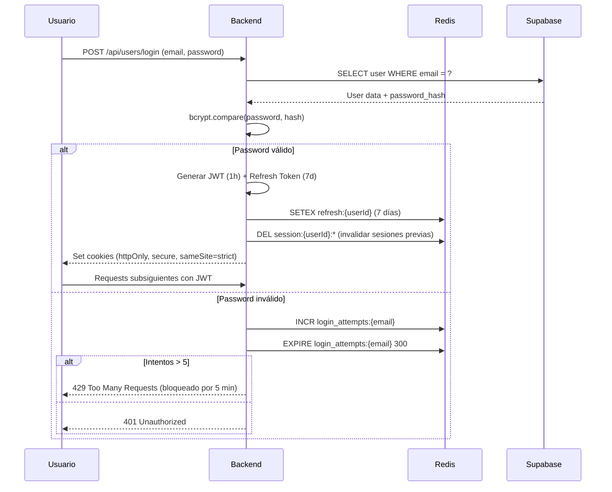
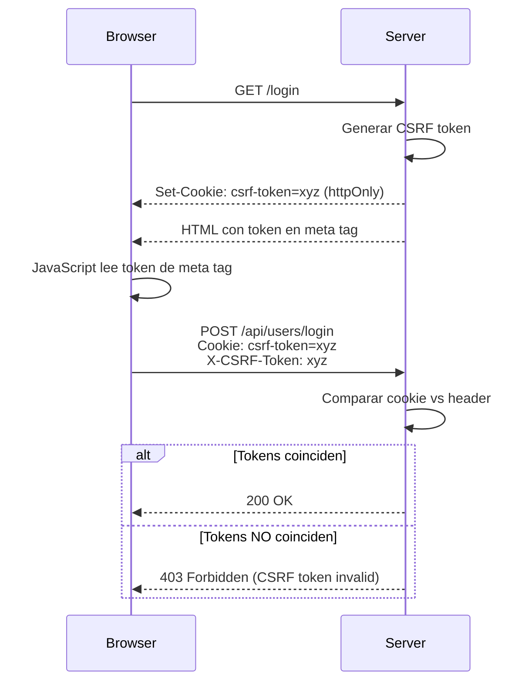

# Documentación de Seguridad de Acadelia

## Tabla de Contenidos

1. [Visión General](#visión-general)
2. [Modelo de Seguridad en Capas](#modelo-de-seguridad-en-capas)
3. [Autenticación y Autorización](#autenticación-y-autorización)
4. [Protección CSRF](#protección-csrf)
5. [Rate Limiting](#rate-limiting)
6. [Seguridad de Archivos](#seguridad-de-archivos)
7. [Headers HTTP Seguros](#headers-http-seguros)
8. [Prevención de Inyecciones](#prevención-de-inyecciones)
9. [Logging y Monitoreo de Seguridad](#logging-y-monitoreo-de-seguridad)
10. [Mejores Prácticas](#mejores-prácticas)

---

## Visión General

Acadelia implementa un **modelo de seguridad en 8 capas** que proporciona defensa en profundidad contra amenazas comunes. Cada capa añade una barrera adicional de protección.

### Principios de Seguridad

1. **Defense in Depth**: Múltiples capas de seguridad
2. **Least Privilege**: Usuarios solo tienen los permisos necesarios
3. **Fail Secure**: Los errores no comprometen la seguridad
4. **Security by Design**: Seguridad integrada desde el diseño
5. **Zero Trust**: Nunca confiar, siempre verificar

---

## Modelo de Seguridad en Capas

```
┌─────────────────────────────────────────────────────────┐
│  Capa 8: Monitoreo y Alertas                            │
│  - Logging de eventos de seguridad                      │
│  - Detección de anomalías                               │
│  - Alertas en tiempo real                               │
└─────────────────────────────────────────────────────────┘
┌─────────────────────────────────────────────────────────┐
│  Capa 7: Seguridad de Archivos                          │
│  - ClamAV (antivirus)                                    │
│  - Validación de MIME types                             │
│  - Límites de tamaño                                     │
└─────────────────────────────────────────────────────────┘
┌─────────────────────────────────────────────────────────┐
│  Capa 6: Rate Limiting                                   │
│  - Rate limiting distribuido (Redis)                     │
│  - Límites por usuario y por IP                         │
│  - Diferentes límites según plan (Free/Premium)         │
└─────────────────────────────────────────────────────────┘
┌─────────────────────────────────────────────────────────┐
│  Capa 5: Autorización                                    │
│  - Control de acceso a AVAs                             │
│  - Verificación de permisos por recurso                 │
│  - Token limits por plan                                │
└─────────────────────────────────────────────────────────┘
┌─────────────────────────────────────────────────────────┐
│  Capa 4: Autenticación                                   │
│  - JWT + Refresh Tokens                                 │
│  - Single session enforcement                           │
│  - Token rotation                                       │
└─────────────────────────────────────────────────────────┘
┌─────────────────────────────────────────────────────────┐
│  Capa 3: CSRF Protection                                 │
│  - Cookie-based CSRF tokens                             │
│  - Double submit pattern                                │
│  - Validación en requests mutantes                      │
└─────────────────────────────────────────────────────────┘
┌─────────────────────────────────────────────────────────┐
│  Capa 2: Headers HTTP Seguros                           │
│  - Helmet (CSP, HSTS, X-Frame-Options, etc.)            │
│  - CORS estricto                                        │
│  - Cookie flags (httpOnly, secure, sameSite)            │
└─────────────────────────────────────────────────────────┘
┌─────────────────────────────────────────────────────────┐
│  Capa 1: Network Security                                │
│  - HTTPS obligatorio                                     │
│  - TLS 1.2+                                             │
│  - DNS Security                                         │
└─────────────────────────────────────────────────────────┘
```

---

## Autenticación y Autorización

### JWT (JSON Web Tokens)

Acadelia usa JWT con refresh tokens para autenticación stateless.

#### Estructura del JWT

```javascript
{
  "userId": "uuid",
  "email": "user@example.com",
  "plan": "free|premium",
  "iat": 1234567890,    // Issued at
  "exp": 1234571490     // Expires at (1 hora después)
}
```

#### Flow de Autenticación



#### Implementación

**Middleware de Autenticación** (`backend/middlewares/authMiddleware.js`):

```javascript
export const authenticateUser = async (req, res, next) => {
  const token = req.cookies['auth-token'];

  if (!token) {
    return res.status(401).json({
      error: 'No autenticado',
      code: 'NO_TOKEN'
    });
  }

  try {
    // Verificar JWT
    const decoded = jwt.verify(token, process.env.JWT_SECRET);

    // Verificar blacklist (tokens invalidados)
    const isBlacklisted = await redis.exists(`blacklist:${token}`);
    if (isBlacklisted) {
      return res.status(401).json({
        error: 'Token invalidado',
        code: 'TOKEN_BLACKLISTED'
      });
    }

    // Verificar que la sesión aún existe
    const sessionExists = await redis.exists(`session:${decoded.userId}`);
    if (!sessionExists) {
      return res.status(401).json({
        error: 'Sesión expirada',
        code: 'SESSION_EXPIRED'
      });
    }

    req.user = decoded;
    next();

  } catch (error) {
    if (error.name === 'TokenExpiredError') {
      // Intentar renovar con refresh token
      const refreshed = await refreshAccessToken(req, res);
      if (refreshed) {
        return next();
      }
    }

    return res.status(401).json({
      error: 'Token inválido',
      code: 'INVALID_TOKEN'
    });
  }
};

const refreshAccessToken = async (req, res) => {
  const refreshToken = req.cookies['refresh-token'];

  if (!refreshToken) return false;

  try {
    const decoded = jwt.verify(refreshToken, process.env.JWT_SECRET);

    // Verificar que el refresh token existe en Redis
    const storedToken = await redis.get(`refresh:${decoded.userId}`);
    if (storedToken !== refreshToken) {
      return false;
    }

    // Generar nuevo access token
    const newAccessToken = jwt.sign(
      { userId: decoded.userId, email: decoded.email, plan: decoded.plan },
      process.env.JWT_SECRET,
      { expiresIn: '1h' }
    );

    // Actualizar cookie
    res.cookie('auth-token', newAccessToken, {
      httpOnly: true,
      secure: process.env.NODE_ENV === 'production',
      sameSite: 'strict',
      maxAge: 60 * 60 * 1000 // 1 hora
    });

    req.user = decoded;
    return true;

  } catch (error) {
    return false;
  }
};
```

### Single Session Enforcement

Solo una sesión activa por usuario. Login en otro dispositivo invalida sesiones previas.

```javascript
// Al hacer login
const invalidatePreviousSessions = async (userId) => {
  // Eliminar todas las sesiones previas
  const keys = await redis.keys(`session:${userId}:*`);
  if (keys.length > 0) {
    await redis.del(...keys);
  }

  // Crear nueva sesión
  const sessionId = crypto.randomUUID();
  await redis.setex(
    `session:${userId}:${sessionId}`,
    7 * 24 * 60 * 60, // 7 días
    JSON.stringify({ createdAt: Date.now() })
  );

  return sessionId;
};
```

### Autorización (Control de Acceso)

Control de acceso a nivel de recurso (AVAs, herramientas).

**Middleware de Access Control** (`backend/middlewares/accessControlMiddleware.js`):

```javascript
export const verifyAvaAccess = async (req, res, next) => {
  const userId = req.user.id;
  const { avaId, chatId } = req.body;

  try {
    // Verificar que el usuario tiene acceso al AVA
    const { data: avaAccess, error } = await supabase
      .from('user_ava_access')
      .select('*')
      .eq('user_id', userId)
      .eq('ava_id', avaId)
      .single();

    if (error || !avaAccess) {
      return res.status(403).json({
        error: 'No tienes acceso a este agente',
        code: 'AVA_ACCESS_DENIED'
      });
    }

    // Verificar límites de tokens según plan
    const tokenLimitOk = await checkTokenLimits(userId, req.user.plan);
    if (!tokenLimitOk) {
      return res.status(429).json({
        error: 'Límite de mensajes alcanzado',
        code: 'MESSAGE_LIMIT_REACHED'
      });
    }

    next();

  } catch (error) {
    logger.error('Error in verifyAvaAccess:', error);
    res.status(500).json({ error: 'Error verificando acceso' });
  }
};

const checkTokenLimits = async (userId, plan) => {
  if (plan === 'premium') return true; // Sin límites

  // Free plan: 10 mensajes/día, 3 mensajes/hora
  const dailyKey = `limits:daily:${userId}:${new Date().toISOString().slice(0, 10)}`;
  const hourlyKey = `limits:hourly:${userId}:${new Date().toISOString().slice(0, 13)}`;

  const [dailyCount, hourlyCount] = await Promise.all([
    redis.incr(dailyKey),
    redis.incr(hourlyKey)
  ]);

  // Set expiration si es el primer incr
  if (dailyCount === 1) await redis.expire(dailyKey, 24 * 60 * 60);
  if (hourlyCount === 1) await redis.expire(hourlyKey, 60 * 60);

  return dailyCount <= 10 && hourlyCount <= 3;
};
```

---

## Protección CSRF

Cross-Site Request Forgery protection mediante **double submit cookie pattern**.

### Flujo CSRF



### Implementación

**Generación de Token** (`backend/middlewares/csrfMiddleware.js`):

```javascript
export const generateCsrfToken = (req, res, next) => {
  if (!req.cookies['csrf-token']) {
    const token = crypto.randomBytes(32).toString('hex');

    res.cookie('csrf-token', token, {
      httpOnly: false,  // Necesita ser accesible desde JavaScript
      secure: process.env.NODE_ENV === 'production',
      sameSite: 'strict',
      maxAge: 24 * 60 * 60 * 1000 // 24 horas
    });

    req.csrfToken = token;
  }

  next();
};

export const validateCsrfToken = (req, res, next) => {
  // Solo validar en métodos mutantes
  if (!['POST', 'PUT', 'DELETE', 'PATCH'].includes(req.method)) {
    return next();
  }

  const cookieToken = req.cookies['csrf-token'];
  const headerToken = req.headers['x-csrf-token'];

  if (!cookieToken || !headerToken) {
    return res.status(403).json({
      error: 'CSRF token missing',
      code: 'CSRF_TOKEN_MISSING'
    });
  }

  if (cookieToken !== headerToken) {
    logger.warn('CSRF token mismatch', {
      userId: req.user?.id,
      ip: req.ip,
      path: req.path
    });

    return res.status(403).json({
      error: 'CSRF token invalid',
      code: 'CSRF_TOKEN_INVALID'
    });
  }

  next();
};
```

**Frontend (JavaScript)**:

```javascript
// Leer token del cookie
const getCsrfToken = () => {
  return document.cookie
    .split('; ')
    .find(row => row.startsWith('csrf-token='))
    ?.split('=')[1];
};

// Incluir en requests
fetch('/api/users/update', {
  method: 'POST',
  headers: {
    'Content-Type': 'application/json',
    'X-CSRF-Token': getCsrfToken()
  },
  body: JSON.stringify(data)
});
```

---

## Rate Limiting

Rate limiting distribuido con Redis para prevenir abuso.

### Estrategia de Rate Limiting

**Por Plan**:
- **Free**: 10 mensajes/día, 3 mensajes/hora
- **Premium**: Sin límites de mensajes

**Por Endpoint**:
- Login: 5 intentos/5 minutos por IP
- Chat: Variable según plan
- Admin endpoints: 100 requests/hora
- Public endpoints: 1000 requests/hora por IP

### Implementación

**Rate Limiter Genérico** (`backend/middlewares/rateLimitMiddleware.js`):

```javascript
import rateLimit from 'express-rate-limit';
import RedisStore from 'rate-limit-redis';
import { redisClient } from '../lib/redis.js';

export const createRateLimiter = (options) => {
  return rateLimit({
    store: new RedisStore({
      client: redisClient,
      prefix: `acadelia:ratelimit:${options.name}:`
    }),
    windowMs: options.windowMs,
    max: options.max,
    message: options.message || 'Demasiadas solicitudes',
    standardHeaders: true,  // Return rate limit info in headers
    legacyHeaders: false,
    handler: (req, res) => {
      logger.warn('Rate limit exceeded', {
        identifier: options.keyGenerator ? options.keyGenerator(req) : req.ip,
        endpoint: req.path,
        limit: options.max
      });

      res.status(429).json({
        error: options.message || 'Demasiadas solicitudes',
        code: 'RATE_LIMIT_EXCEEDED',
        retryAfter: res.getHeader('Retry-After')
      });
    },
    skip: (req) => {
      // Bypass para ciertos casos (testing, admin override)
      if (process.env.SECURITY_BYPASS === 'true') return true;
      if (req.user?.role === 'admin') return true;
      return false;
    },
    keyGenerator: options.keyGenerator || ((req) => req.ip)
  });
};

// Rate limiters específicos
export const loginRateLimiter = createRateLimiter({
  name: 'login',
  windowMs: 5 * 60 * 1000,  // 5 minutos
  max: 5,
  message: 'Demasiados intentos de login, intenta más tarde',
  keyGenerator: (req) => req.body.email || req.ip
});

export const chatRateLimiter = createRateLimiter({
  name: 'chat',
  windowMs: 60 * 60 * 1000,  // 1 hora
  max: async (req) => {
    // Límite dinámico según plan
    return req.user.plan === 'premium' ? 1000 : 3;
  },
  message: 'Límite de mensajes alcanzado. Considera actualizar a Premium.',
  keyGenerator: (req) => req.user.id
});

export const apiRateLimiter = createRateLimiter({
  name: 'api',
  windowMs: 60 * 60 * 1000,  // 1 hora
  max: 100,
  message: 'Límite de API alcanzado'
});
```

**Aplicación en rutas**:

```javascript
// server.js
app.post('/api/users/login', loginRateLimiter, userController.login);
app.post('/api/chat/*', authenticateUser, chatRateLimiter, chatController.handleChat);
app.use('/api/*', apiRateLimiter);
```

---

## Seguridad de Archivos

### ClamAV (Antivirus)

Escaneo en tiempo real de archivos subidos.

**Implementación** (`backend/middlewares/securityMiddleware.js`):

```javascript
import { exec } from 'child_process';
import { promisify } from 'util';
import path from 'path';
import fs from 'fs';

const execAsync = promisify(exec);
const QUARANTINE_DIR = '/var/quarantine/acadelia';

export const scanFileWithClamAV = async (filePath) => {
  try {
    const { stdout, stderr } = await execAsync(
      `clamscan --no-summary "${filePath}"`
    );

    // ClamAV retorna "Infected files: 0" si está limpio
    if (stdout.includes('Infected files: 0')) {
      logger.info('File scan passed', { filePath });
      return { safe: true };
    } else {
      // Archivo infectado - mover a cuarentena
      const fileName = path.basename(filePath);
      const quarantinePath = path.join(QUARANTINE_DIR, fileName);

      fs.mkdirSync(QUARANTINE_DIR, { recursive: true });
      fs.renameSync(filePath, quarantinePath);

      logger.error('Infected file detected', {
        originalPath: filePath,
        quarantinePath,
        scanResult: stdout
      });

      return {
        safe: false,
        reason: 'Archivo infectado detectado',
        scanResult: stdout
      };
    }

  } catch (error) {
    logger.error('ClamAV scan error', { error, filePath });

    // Fail secure: rechazar archivo si el scan falla
    return {
      safe: false,
      reason: 'Error escaneando archivo',
      error: error.message
    };
  }
};
```

### Validación de Archivos

Múltiples validaciones antes de aceptar archivos.

```javascript
export const validateUploadedFile = async (file, options = {}) => {
  const errors = [];

  // 1. Validar tamaño
  const maxSize = options.maxSize || 50 * 1024 * 1024; // 50MB default
  if (file.size > maxSize) {
    errors.push(`Archivo demasiado grande. Máximo: ${maxSize / 1024 / 1024}MB`);
  }

  // 2. Validar tipo MIME
  const allowedMimeTypes = options.allowedMimeTypes || [
    'application/pdf',
    'image/png',
    'image/jpeg',
    'audio/mpeg',
    'audio/wav',
    'video/mp4'
  ];

  if (!allowedMimeTypes.includes(file.mimetype)) {
    errors.push(`Tipo de archivo no permitido: ${file.mimetype}`);
  }

  // 3. Validar extensión (double check)
  const ext = path.extname(file.originalname).toLowerCase();
  const allowedExtensions = options.allowedExtensions || [
    '.pdf', '.png', '.jpg', '.jpeg', '.mp3', '.wav', '.mp4'
  ];

  if (!allowedExtensions.includes(ext)) {
    errors.push(`Extensión no permitida: ${ext}`);
  }

  // 4. Validar nombre de archivo (prevenir directory traversal)
  if (file.originalname.includes('..') || file.originalname.includes('/')) {
    errors.push('Nombre de archivo inválido');
  }

  // 5. Escanear con ClamAV
  const scanResult = await scanFileWithClamAV(file.path);
  if (!scanResult.safe) {
    errors.push(scanResult.reason);
  }

  return {
    valid: errors.length === 0,
    errors
  };
};
```

**Uso en endpoints**:

```javascript
app.post('/api/chat/document',
  authenticateUser,
  upload.single('document'),
  async (req, res) => {
    const validation = await validateUploadedFile(req.file, {
      allowedMimeTypes: ['application/pdf'],
      maxSize: 20 * 1024 * 1024 // 20MB
    });

    if (!validation.valid) {
      // Eliminar archivo rechazado
      fs.unlinkSync(req.file.path);

      return res.status(400).json({
        error: 'Archivo inválido',
        details: validation.errors
      });
    }

    // Procesar archivo...
  }
);
```

---

## Headers HTTP Seguros

### Helmet Configuration

Helmet configura múltiples headers de seguridad.

```javascript
// server.js
import helmet from 'helmet';

app.use(helmet({
  contentSecurityPolicy: {
    directives: {
      defaultSrc: ["'self'"],
      scriptSrc: [
        "'self'",
        "'unsafe-inline'",  // Necesario para algunos scripts inline
        "cdn.jsdelivr.net",
        "unpkg.com"
      ],
      styleSrc: [
        "'self'",
        "'unsafe-inline'",  // Necesario para estilos inline
        "fonts.googleapis.com"
      ],
      fontSrc: [
        "'self'",
        "fonts.gstatic.com"
      ],
      imgSrc: [
        "'self'",
        "data:",
        "https:",
        "blob:"
      ],
      connectSrc: [
        "'self'",
        process.env.SUPABASE_URL
      ],
      frameSrc: ["'none'"],
      objectSrc: ["'none'"],
      upgradeInsecureRequests: []
    }
  },
  hsts: {
    maxAge: 31536000,        // 1 año
    includeSubDomains: true,
    preload: true
  },
  frameguard: {
    action: 'deny'           // Prevenir clickjacking
  },
  noSniff: true,             // X-Content-Type-Options: nosniff
  xssFilter: true,           // X-XSS-Protection: 1; mode=block
  referrerPolicy: {
    policy: 'strict-origin-when-cross-origin'
  }
}));
```

### CORS Configuration

CORS estricto, solo permite orígenes específicos.

```javascript
import cors from 'cors';

const allowedOrigins = [
  'https://acadelia.com',
  'https://www.acadelia.com',
  ...(process.env.NODE_ENV === 'development' ? ['http://localhost:3000'] : [])
];

app.use(cors({
  origin: (origin, callback) => {
    // Permitir requests sin origin (mobile apps, Postman)
    if (!origin) return callback(null, true);

    if (allowedOrigins.includes(origin)) {
      callback(null, true);
    } else {
      logger.warn('CORS blocked origin', { origin });
      callback(new Error('CORS policy violation'));
    }
  },
  credentials: true,  // Permitir cookies
  methods: ['GET', 'POST', 'PUT', 'DELETE'],
  allowedHeaders: ['Content-Type', 'Authorization', 'X-CSRF-Token']
}));
```

### Cookie Security

Cookies configuradas con flags de seguridad.

```javascript
// Configuración de sesión
app.use(session({
  secret: process.env.SESSION_SECRET,
  resave: false,
  saveUninitialized: false,
  cookie: {
    httpOnly: true,      // No accesible desde JavaScript
    secure: process.env.NODE_ENV === 'production',  // Solo HTTPS en prod
    sameSite: 'strict',  // Prevenir CSRF
    maxAge: 24 * 60 * 60 * 1000  // 24 horas
  },
  store: new RedisStore({
    client: redisClient,
    prefix: 'acadelia:session:'
  })
}));
```

---

## Prevención de Inyecciones

### SQL Injection Prevention

Uso de **prepared statements** y **ORM** (Supabase client).

```javascript
// ✅ CORRECTO - Usando Supabase client (previene SQLi)
const { data, error } = await supabase
  .from('users')
  .select('*')
  .eq('email', userEmail);  // Supabase sanitiza automáticamente

// ✅ CORRECTO - Si usas SQL directo, usa placeholders
const { data, error } = await supabase
  .rpc('get_user_by_email', {
    user_email: userEmail  // Parámetro nombrado, sanitizado
  });

// ❌ INCORRECTO - Nunca concatenar strings
const query = `SELECT * FROM users WHERE email = '${userEmail}'`;  // VULNERABLE!
```

### NoSQL Injection Prevention (Redis)

Validación estricta de keys antes de usar en Redis.

```javascript
const sanitizeRedisKey = (key) => {
  // Solo permitir alfanuméricos, guiones y underscores
  return key.replace(/[^a-zA-Z0-9\-_:]/g, '');
};

// Uso
const userId = sanitizeRedisKey(req.user.id);
const sessionKey = `session:${userId}`;
await redis.get(sessionKey);
```

### XSS Prevention

Sanitización de inputs y escape de outputs.

```javascript
import DOMPurify from 'isomorphic-dompurify';

// Sanitizar HTML antes de guardar
const sanitizeHtml = (html) => {
  return DOMPurify.sanitize(html, {
    ALLOWED_TAGS: ['b', 'i', 'em', 'strong', 'a', 'p', 'br'],
    ALLOWED_ATTR: ['href']
  });
};

// En el frontend, escapar texto antes de insertar en DOM
const escapeHtml = (text) => {
  const div = document.createElement('div');
  div.textContent = text;
  return div.innerHTML;
};
```

### Command Injection Prevention

Validación estricta antes de ejecutar comandos del sistema.

```javascript
// ❌ INCORRECTO - Nunca usar input del usuario directamente
exec(`ffmpeg -i ${userFilename} output.mp3`);  // VULNERABLE!

// ✅ CORRECTO - Validar y sanitizar
const sanitizeFilename = (filename) => {
  // Remover caracteres peligrosos
  return filename.replace(/[^a-zA-Z0-9._-]/g, '');
};

const safeFilename = sanitizeFilename(userFilename);
exec(`ffmpeg -i "${safeFilename}" output.mp3`);  // Más seguro

// ✅ MEJOR - Usar arrays en vez de strings
import { spawn } from 'child_process';

const ffmpeg = spawn('ffmpeg', ['-i', userFilename, 'output.mp3']);
// spawn NO ejecuta shell, previene injection
```

---

## Logging y Monitoreo de Seguridad

### Security Logger

Logger dedicado para eventos de seguridad.

```javascript
// backend/utils/security/securityLogger.js
import winston from 'winston';

export const securityLogger = winston.createLogger({
  level: 'warn',
  format: winston.format.combine(
    winston.format.timestamp(),
    winston.format.json()
  ),
  transports: [
    new winston.transports.File({
      filename: 'backend/logs/security.log',
      level: 'warn'
    }),
    new winston.transports.File({
      filename: 'backend/logs/security-error.log',
      level: 'error'
    })
  ]
});

// Eventos a logear
export const logSecurityEvent = (event, details) => {
  const eventTypes = {
    'login_failed': 'warn',
    'csrf_violation': 'warn',
    'rate_limit_exceeded': 'warn',
    'infected_file': 'error',
    'unauthorized_access': 'error',
    'sql_injection_attempt': 'error',
    'suspicious_activity': 'error'
  };

  const level = eventTypes[event] || 'warn';

  securityLogger[level]({
    event,
    ...details,
    timestamp: new Date().toISOString()
  });

  // Enviar alertas críticas
  if (level === 'error') {
    sendSecurityAlert(event, details);
  }
};
```

### Detección de Actividad Sospechosa

Patrones que indican posibles ataques.

```javascript
const detectSuspiciousActivity = async (req) => {
  const userId = req.user?.id;
  const ip = req.ip;

  // 1. Múltiples IPs para un usuario
  const userIpKey = `security:user_ips:${userId}`;
  await redis.sadd(userIpKey, ip);
  const uniqueIps = await redis.scard(userIpKey);

  if (uniqueIps > 5) {
    logSecurityEvent('suspicious_activity', {
      reason: 'multiple_ips',
      userId,
      uniqueIps
    });
  }

  // 2. Múltiples cuentas desde una IP
  const ipUserKey = `security:ip_users:${ip}`;
  await redis.sadd(ipUserKey, userId);
  const uniqueUsers = await redis.scard(ipUserKey);

  if (uniqueUsers > 10) {
    logSecurityEvent('suspicious_activity', {
      reason: 'multiple_accounts',
      ip,
      uniqueUsers
    });
  }

  // 3. Patrones de acceso inusuales
  const accessPattern = `security:access_pattern:${userId}`;
  await redis.rpush(accessPattern, `${Date.now()}:${req.path}`);
  await redis.ltrim(accessPattern, -100, -1);  // Mantener últimas 100

  // Analizar patrón...
};
```

### Auditoría de Acciones Críticas

Log de acciones importantes para auditoría.

```javascript
const auditLog = async (action, details) => {
  await supabase.from('activity_log').insert({
    user_id: details.userId,
    action,
    details: JSON.stringify(details),
    ip_address: details.ip,
    user_agent: details.userAgent,
    created_at: new Date()
  });
};

// Acciones a auditar
// - Login/Logout
// - Cambio de contraseña
// - Eliminación de cuenta
// - Acceso a datos sensibles
// - Cambios de configuración
```

---

## Mejores Prácticas

### 1. Gestión de Secretos

```bash
# ❌ NUNCA hacer commit de .env
git add .env  # NO!

# ✅ Usar variables de entorno
export OPENAI_API_KEY=sk-...

# ✅ Usar .env.example con placeholders
OPENAI_API_KEY=your-api-key-here

# ✅ En producción, usar secrets manager
# - Fly.io Secrets
# - AWS Secrets Manager
# - HashiCorp Vault
```

### 2. Rotación de Secretos

```javascript
// Rotar JWT secret periódicamente
const rotateJwtSecret = async () => {
  const newSecret = crypto.randomBytes(64).toString('hex');

  // 1. Guardar nuevo secret
  process.env.JWT_SECRET_NEW = newSecret;

  // 2. Período de transición (verificar con ambos secrets)
  // ...

  // 3. Después de 24h, eliminar secret antiguo
  delete process.env.JWT_SECRET_OLD;
  process.env.JWT_SECRET = newSecret;
};
```

### 3. Principio de Least Privilege

```javascript
// ❌ Usuario con todos los permisos
const user = {
  role: 'admin',
  canAccessAllAvas: true
};

// ✅ Permisos granulares
const user = {
  role: 'user',
  permissions: [
    'ava:read:algebra',
    'ava:read:calculo',
    'herramienta:use:pdf'
  ]
};
```

### 4. Input Validation

```javascript
import Joi from 'joi';

const chatQuerySchema = Joi.object({
  chatId: Joi.string().uuid().required(),
  message: Joi.string().min(1).max(5000).required(),
  avaId: Joi.string().uuid().required()
});

app.post('/api/chat', async (req, res) => {
  const { error, value } = chatQuerySchema.validate(req.body);

  if (error) {
    return res.status(400).json({
      error: 'Datos inválidos',
      details: error.details
    });
  }

  // Procesar con datos validados
});
```

### 5. Error Handling Seguro

```javascript
// ❌ Exponer detalles internos
catch (error) {
  res.status(500).json({ error: error.message, stack: error.stack });
}

// ✅ Error genérico al cliente, detalles en logs
catch (error) {
  logger.error('Internal error', { error, userId: req.user?.id });
  res.status(500).json({ error: 'Error interno del servidor' });
}
```

### 6. Dependency Security

```bash
# Auditoría regular de dependencias
npm audit

# Actualizar automáticamente patches de seguridad
npm audit fix

# Revisar vulnerabilidades críticas
npm audit --audit-level=critical
```

---

## Checklist de Seguridad

### Pre-deployment

- [ ] Todas las variables de entorno configuradas correctamente
- [ ] Secretos rotados y no hay secrets hardcodeados
- [ ] npm audit sin vulnerabilidades críticas
- [ ] HTTPS configurado correctamente
- [ ] CORS configurado para dominios específicos
- [ ] Rate limiting activado
- [ ] ClamAV funcionando
- [ ] Logs de seguridad configurados
- [ ] Headers HTTP seguros (Helmet)
- [ ] CSRF protection activado

### Post-deployment

- [ ] Monitorear logs de seguridad
- [ ] Revisar rate limit metrics
- [ ] Verificar que ClamAV está actualizando firmas
- [ ] Revisar intentos de login fallidos
- [ ] Auditar accesos a endpoints sensibles
- [ ] Verificar alertas de seguridad

---

## Reporte de Vulnerabilidades

Si encuentras una vulnerabilidad de seguridad, **NO** la reportes como issue público.

Contacta a: [security@acadelia.com](mailto:security@acadelia.com)

O usa GitHub Security Advisories (privado).

Incluye:
- Descripción de la vulnerabilidad
- Pasos para reproducir
- Impacto potencial
- Sugerencias de fix (opcional)

---

## Referencias

- [OWASP Top 10](https://owasp.org/www-project-top-ten/)
- [OWASP Cheat Sheets](https://cheatsheetseries.owasp.org/)
- [Node.js Security Best Practices](https://nodejs.org/en/docs/guides/security/)
- [Express Security Best Practices](https://expressjs.com/en/advanced/best-practice-security.html)
